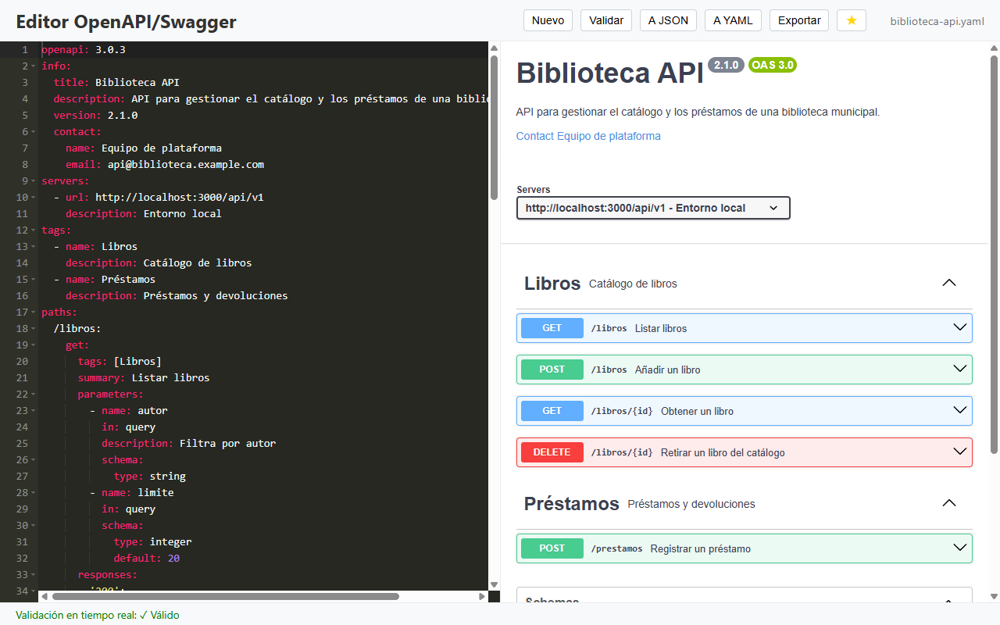
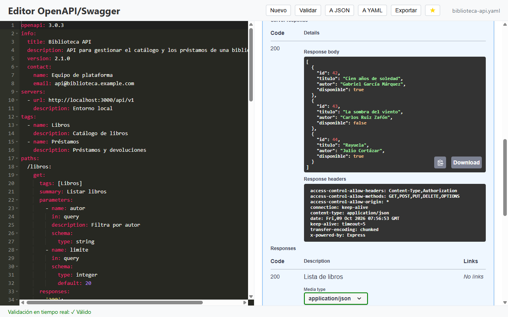
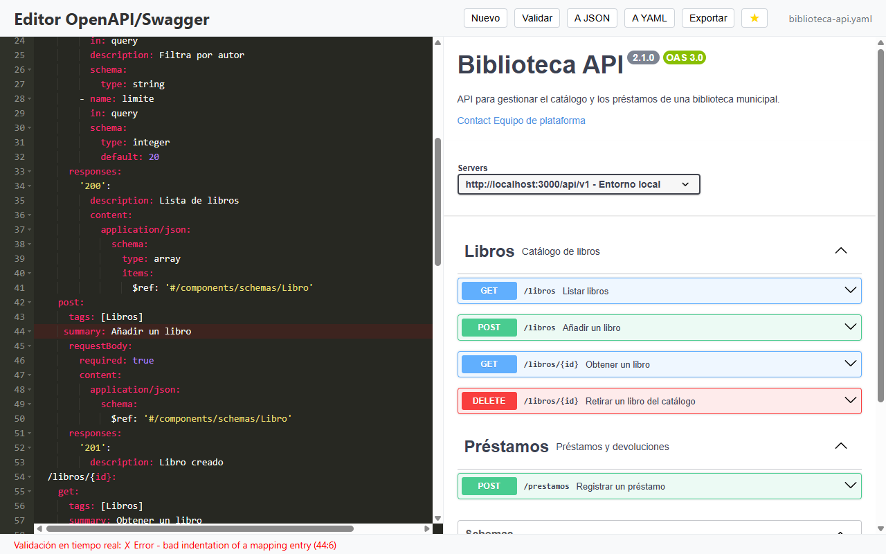
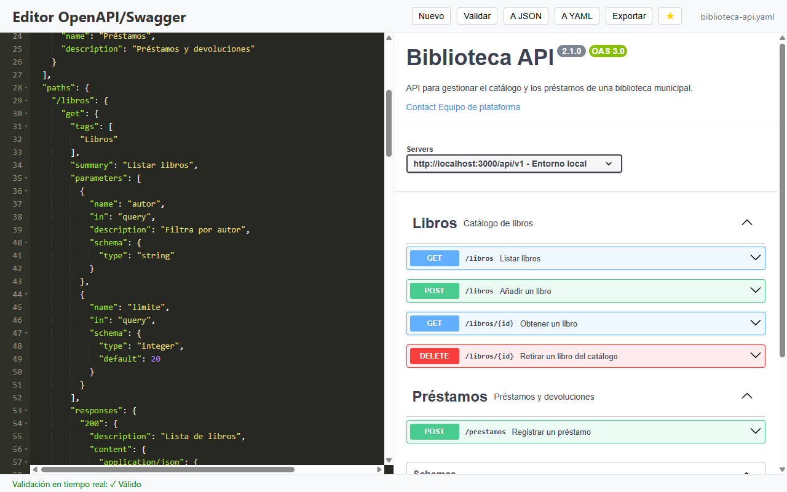
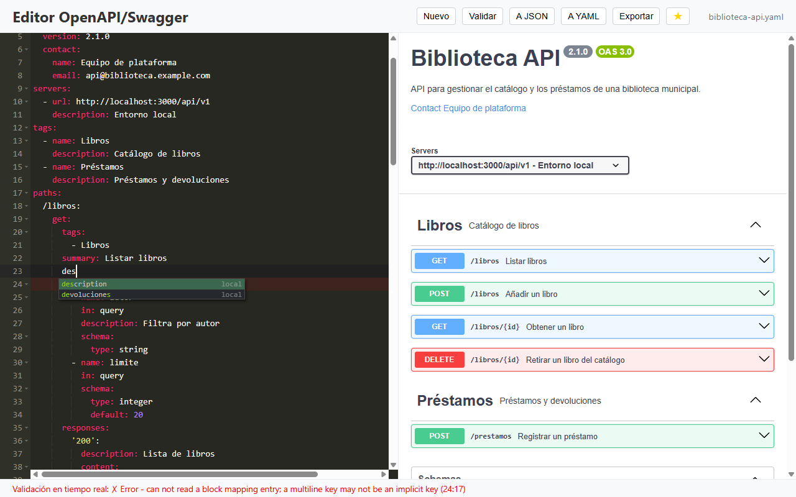

# OpenAPI Swagger Editor

Aplicación de escritorio para editar, previsualizar, validar y probar especificaciones OpenAPI/Swagger en YAML o JSON.

**Web y descargas:** https://cmurestudillos.github.io/openapi-swagger/

> Proyecto personal e independiente: no está afiliado a SmartBear ni es el
> [Swagger Editor oficial](https://editor.swagger.io/).



## Características

- **Editor ACE** con resaltado de YAML y JSON, plegado de bloques y autocompletado con las palabras del documento.
- **Vista previa en vivo** con Swagger UI (OpenAPI 3.0, 3.1 y Swagger 2.0).
- **Validación al escribir**: los errores de sintaxis se marcan en su línea y la barra de estado indica si el documento
  es válido.
- **Probar endpoints** con _Try it out_ a través de un proxy local (solo `127.0.0.1`, con token por sesión), sin
  problemas de CORS.
- **Conversión YAML ↔ JSON** con un clic.
- **Exportación** a YAML, JSON o una página HTML con la documentación.
- **Favoritos** y **archivos recientes** (los 10 últimos) en el menú _Archivo_.
- **Autoguardado** cada 10 minutos, con recuperación del documento sin guardar al arrancar.

### Atajos

| Acción       | Windows / Linux | macOS |
| ------------ | --------------- | ----- |
| Nuevo        | `Ctrl+N`        | `⌘N`  |
| Abrir        | `Ctrl+O`        | `⌘O`  |
| Guardar      | `Ctrl+S`        | `⌘S`  |
| Guardar como | `Ctrl+Shift+S`  | `⌘⇧S` |
| Salir        | `Ctrl+Q`        | `⌘Q`  |

### Limitaciones

- La validación es básica: sintaxis + `openapi`/`swagger`, `info` y `paths`. No valida esquemas ni resuelve `$ref`.
- El HTML exportado carga Swagger UI desde cdnjs (necesita conexión para verse).
- _Guardar como_ escribe el contenido tal cual: para un `.json` a partir de YAML, convierte antes con **A JSON** o usa
  **Exportar**.

## Capturas

| Probar un endpoint                                           | Validación                                         |
| ------------------------------------------------------------ | -------------------------------------------------- |
|  |  |

| Conversión a JSON                                | Autocompletado                                              |
| ------------------------------------------------ | ----------------------------------------------------------- |
|  |  |

### Regenerar las capturas

Las capturas de `docs/assets/screenshots/` son reales. Se generan con un script de Electron que se guarda **fuera del
repositorio** y que:

1. Carga el `main.js`, el `index.html` y el `preload.js` reales, con `userData` en una carpeta temporal.
2. Sustituye `dialog.showOpenDialog`/`showSaveDialog` para abrir una spec de ejemplo («Biblioteca API») y levanta un
   backend falso en `localhost:3000` para el _Try it out_.
3. Pulsa la interfaz con `webContents.executeJavaScript` (abrir, favorito, _Try it out_, error de sintaxis, A JSON,
   autocompletado).
4. Llama a `webContents.invalidate()` antes de cada `capturePage()` (si no, se captura el fotograma anterior) y guarda
   los PNG a 1280×800 (`--force-device-scale-factor=1`).

Después hay que revisar las imágenes y la web en claro/oscuro y a 390 px de ancho.

## Desarrollo

Requisitos: Node.js 22.12+ y pnpm 11+.

```bash
git clone https://github.com/cmurestudillos/openapi-swagger.git
cd openapi-swagger
pnpm install

pnpm start           # ejecutar en desarrollo
pnpm lint            # ESLint + Prettier
pnpm package:win     # instalador de Windows (en release/)
pnpm package:mac     # imagen de macOS
pnpm package:linux   # AppImage
```

### Estructura

```
├── main.js                  # proceso principal: ventana, menús, diálogos, IPC y configuración
├── preload.js               # puente IPC seguro (contextIsolation activo)
├── renderer.js              # interfaz: editor ACE, Swagger UI, validación y autoguardado
├── proxy-server.js          # proxy CORS local (Express, solo 127.0.0.1 y con token)
├── swagger-parser-loader.js # validación básica de la especificación
├── index.html · style.css   # ventana de la app
├── assets/                  # iconos
├── docs/                    # landing (GitHub Pages), excluida del paquete
└── .github/workflows/       # release.yml (instaladores) y pr-review.yml
```

## Publicar una versión

Los instaladores de Windows (`.exe`), macOS (`.dmg`, Apple Silicon) y Linux (`.AppImage`) los genera GitHub Actions
(`.github/workflows/release.yml`) al subir un tag `vX.Y.Z`:

1. Sube la versión en `package.json` y haz commit (el workflow comprueba que el tag coincide).
2. Crea el tag anotado: `git tag -a v1.0.1 -m "v1.0.1"`.
3. Sube la rama y el tag: `git push origin develop` y `git push origin v1.0.1`.
4. En _Actions_ aparece **Release vX.Y.Z** con 4 jobs (borrador + Windows + macOS + Linux).
5. Revisa el borrador en _Releases_ (`Swagger-Editor-Setup-X.Y.Z.exe`, `Swagger-Editor-X.Y.Z-arm64.dmg`,
   `Swagger-Editor-X.Y.Z.AppImage`) y pulsa **Publish release**. La web enlaza sola a la nueva versión.

Si un build falla: corrige, borra el tag (`git tag -d vX.Y.Z && git push origin :refs/tags/vX.Y.Z`), vuelve a crearlo
sobre el commit bueno y súbelo; el job del borrador reutiliza el existente.

Los instaladores no están firmados: Windows muestra SmartScreen y macOS Gatekeeper (`xattr -cr "/Applications/Swagger
Editor.app"`).

## Tecnologías

[Electron](https://www.electronjs.org/) · [Ace](https://ace.c9.io/) ·
[Swagger UI](https://swagger.io/tools/swagger-ui/) · [js-yaml](https://github.com/nodeca/js-yaml) ·
[Express](https://expressjs.com/)

## Licencia

MIT (ver `license` en [package.json](package.json)).
